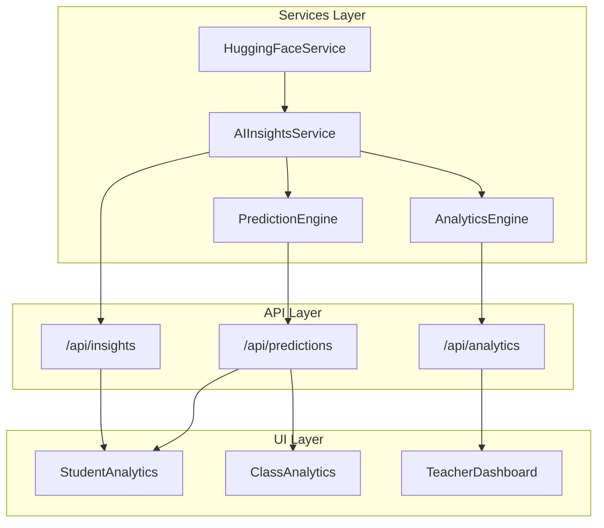

# Module de Prédictions et Analytics - Documentation

## Vue d'ensemble

Ce module fournit un système complet de **prédictions des performances** et **d'analyses statistiques** pour la plateforme éducative QuizLock. Il est conçu pour être **modulaire**, **extensible** et facilement **customisable**.

---

## Architecture



---

## Services Principaux

### 1. PredictionEngine (`lib/services/PredictionEngine.ts`)

**Rôle**: Moteur de prédiction statistique basé sur la **régression linéaire**.

| Méthode | Description | Entrées | Sortie |
|---------|-------------|---------|--------|
| `predictStudentScore()` | Prédit le score d'un étudiant | studentId, syllabusId? | `PredictedScore` |
| `calculateSuccessProbability()` | Probabilité de réussir un examen | studentId, passingScore | `SuccessProbability` |
| `getRankAmongPeers()` | Classement parmi les pairs | studentId, classId | `PeerRanking` |
| `getClassPerformancePrediction()` | Prédiction au niveau classe | classId | `ClassPrediction` |
| `detectDropoutRisk()` | Détection du risque de décrochage | studentId | `RiskAssessment` |
| `identifyWeakConcepts()` | Points faibles par concept | studentId, syllabusId? | `WeakPoint[]` |
| `getProgressionTrend()` | Tendance de progression | studentId, weeks | `ProgressionTrend[]` |
| `getBenchmark()` | Benchmark établissement | schoolId | `SchoolBenchmark` |

**Algorithmes utilisés**:
- **Régression linéaire** (via `simple-statistics`) pour prédire les tendances
- **Coefficient R²** pour mesurer la précision du modèle
- **Pondération temporelle** pour donner plus d'importance aux résultats récents

---

### 2. AnalyticsEngine (`lib/services/AnalyticsEngine.ts`)

**Rôle**: Analyses comparatives et statistiques avancées.

| Méthode | Description | Niveau |
|---------|-------------|--------|
| `identifyStrengthsAndWeaknesses()` | Forces/faiblesses par matière | Étudiant |
| `compareClasses()` | Comparaison inter-classes | École |
| `compareSchools()` | Comparaison inter-établissements | Région/National |
| `analyzeSubjectPerformance()` | Analyse par matière | Classe |
| `generateProgressionReport()` | Rapport de progression | Étudiant |
| `analyzeCohort()` | Analyse de cohorte | Groupe |
| `findCorrelations()` | Corrélations entre facteurs | Groupe |

---

### 3. AIInsightsService (`lib/services/AIInsightsService.ts`)

**Rôle**: Génération d'insights personnalisés et coaching IA.

| Méthode | Description |
|---------|-------------|
| `generatePersonalizedInsights()` | Insights personnalisés (performance, risque, opportunité) |
| `generateLearningRecommendations()` | Recommandations d'apprentissage |
| `generateCoachingMessage()` | Messages de coaching adaptatifs |
| `buildLearningProfile()` | Profil d'apprentissage complet |
| `detectAnomalies()` | Détection d'anomalies comportementales |
| `generatePerformanceForecast()` | Prévisions court/moyen/long terme |
| `generateDailyStudyPlan()` | Plan d'étude quotidien |

---

## API Endpoints

### `/api/predictions`

```typescript
GET /api/predictions
  ?type=score|probability|rank|class|risk|weak|trend|benchmark
  &studentId=<id>
  &classId=<id>
  &syllabusId=<id>
  &schoolId=<id>
```

### `/api/insights` ✅ NEW

```typescript
GET /api/insights
  ?type=insights|recommendations|coaching|profile|anomalies|forecast|plan
  &studentId=<id>
  &limit=5       // for recommendations
  &minutes=60    // for study plan
```

| Type | Description | Access |
|------|-------------|--------|
| `insights` | Insights personnalisés (performance, risque, opportunité) | All |
| `recommendations` | Recommandations d'apprentissage prioritaires | All |
| `coaching` | Message de coaching adaptatif | All |
| `profile` | Profil d'apprentissage complet | All |
| `anomalies` | Détection d'anomalies comportementales | Teachers/Admins |
| `forecast` | Prévisions court/moyen/long terme | All |
| `plan` | Plan d'étude quotidien | All |

### `/api/analytics` ✅ NEW

```typescript
GET /api/analytics
  ?type=strengths|compare-classes|compare-schools|subject|progression|cohort|correlations
  &studentId=<id>
  &classId=<id>
  &schoolId=<id>
  &subjectId=<id>
  &studentIds=id1,id2,id3  // comma-separated for cohort/correlations
```

| Type | Description | Params requis |
|------|-------------|---------------|
| `strengths` | Forces/faiblesses individuelles | studentId |
| `compare-classes` | Comparaison des classes | schoolId |
| `compare-schools` | Comparaison inter-établissements | schoolIds |
| `subject` | Analyse par matière | classId, subjectId |
| `progression` | Rapport de progression | studentId |
| `cohort` | Analyse de cohorte | studentIds |
| `correlations` | Corrélations entre facteurs | studentIds (min 5) |

**Permissions**:
- `STUDENT`: Peut accéder uniquement à ses propres données
- `TEACHER/ADMIN`: Peut accéder aux données de leurs Apprenants et analyses de classe

---

## Composants UI

### StudentAnalytics
Affiche les analytics pour un étudiant:
- Score prédit avec niveau de confiance
- Probabilité de réussite
- Classement parmi les pairs
- Concepts à réviser
- Graphique de progression
- Facteurs de prédiction avec recommandations

### ClassAnalytics
Vue pour enseignants:
- Performance globale de la classe
- Distribution des niveaux de maîtrise
- Étudiants à risque
- Top performers
- Comparaison avec autres classes

---

## Choix Technologiques pour l'IA

### Option Recommandée: **TensorFlow.js** (pour le ML côté client/serveur)

| Critère | TensorFlow.js | externe (OpenAI/HF) | simple-statistics |
|---------|---------------|---------------------|-------------------|
| Coût | Gratuit | Payant | Gratuit |
| Latence | Faible | Élevée | Très faible |
| Offline | ✅ Oui | ❌ Non | ✅ Oui |
| Complexité | Moyenne | Faible | Très faible |
| Personnalisation | ✅ Totale | ⚠️ Limitée | ⚠️ Limitée |

### Stratégie Hybride Recommandée

```
┌─────────────────────────────────────────────────────────────┐
│                    COUCHE PRÉDICTION                        │
├─────────────────────────────────────────────────────────────┤
│  simple-statistics (actuel)                                 │
│  └── Régression linéaire, statistiques de base             │
│  └── R², écart-type, quartiles                             │
├─────────────────────────────────────────────────────────────┤
│  TensorFlow.js (à ajouter)                                  │
│  └── Modèle de prédiction personnalisé                     │
│  └── Classification (risque de décrochage)                 │
│  └── Détection d'anomalies (autoencoder)                   │
├─────────────────────────────────────────────────────────────┤
│  HuggingFace API (existant)                                 │
│  └── Reformulation de questions                             │
│  └── Analyse sémantique des réponses ouvertes              │
└─────────────────────────────────────────────────────────────┘
```

---

## Recommandations pour Avancer avec l'IA

### 1. Phase Actuelle (Statistiques) ✅ FAIT
- `simple-statistics` pour régression linéaire
- Calculs de tendances et corrélations
- Facteurs d'impact

### 2. Phase ML Client (TensorFlow.js)
```bash
npm install @tensorflow/tfjs @tensorflow-models/toxicity
```

**Modèles à implémenter**:
- **Régression**: Prédiction de notes
- **Classification**: Niveau de risque (LOW/MEDIUM/HIGH/CRITICAL)
- **Clustering**: Groupement d'étudiants similaires
- **Séries temporelles**: Prévision de performance

### 3. Phase IA Avancée (API Externes)
- **HuggingFace** (déjà configuré): Reformulation, NLP
- **OpenAI** (optionnel): Génération de feedback textuel
- **Vertex AI**: Pour du ML managed à grande échelle

---

## Configuration Requise

```env
# Déjà configuré
HUGGINGFACE_API_KEY=hf_xxxxx

# À ajouter pour TensorFlow.js avancé (optionnel)
TFJS_BACKEND=webgl  # ou 'cpu', 'wasm'
```

---

## Exemple d'Utilisation

### Côté Serveur
```typescript
import { PredictionEngine } from '@/lib/services/PredictionEngine'
import { AIInsightsService } from '@/lib/services/AIInsightsService'

// Prédiction simple
const prediction = await PredictionEngine.predictStudentScore(studentId)
console.log(`Score prédit: ${prediction.predictedPercentage}%`)
console.log(`Confiance: ${prediction.confidenceLevel}%`)

// Insights IA personnalisés
const insights = await AIInsightsService.generatePersonalizedInsights(studentId)
insights.forEach(i => console.log(`[${i.category}] ${i.title}`))
```

### Côté Client
```tsx
import { StudentAnalytics } from '@/components/analytics/StudentAnalytics'

export function Dashboard() {
  return (
    <StudentAnalytics 
      studentId="123" 
      classId="class-abc" 
      compact={false} 
    />
  )
}
```

---

## Extensibilité

Le système est conçu pour être facilement extensible:

### Ajouter un nouveau type de prédiction
1. Ajouter l'interface dans `PredictionEngine.ts`
2. Implémenter la méthode statique
3. Ajouter le case dans `/api/predictions/route.ts`
4. Créer/modifier le composant UI

### Ajouter un nouveau modèle ML
1. Créer `lib/services/MLModels/<ModelName>.ts`
2. Entraîner/charger le modèle TensorFlow.js
3. Exposer via `PredictionEngine` ou nouveau service
4. Ajouter l'endpoint API correspondant

---

## Performance et Cache

- Les calculs intensifs sont mis en cache côté serveur
- Le `HuggingFaceService` utilise un cache mémoire pour les reformulations
- Les prédictions sont recalculées à chaque appel (pas de cache long-terme pour rester à jour)

---

## Prochaines Étapes Recommandées

1. **[PRIORITÉ HAUTE]** Ajouter TensorFlow.js pour des prédictions ML plus sophistiquées
2. **[PRIORITÉ MOYENNE]** Implémenter le caching Redis pour les prédictions
3. **[PRIORITÉ MOYENNE]** Ajouter des graphiques interactifs (Chart.js ou Recharts)
4. **[PRIORITÉ BASSE]** Intégrer un modèle de langage pour les feedbacks textuels
